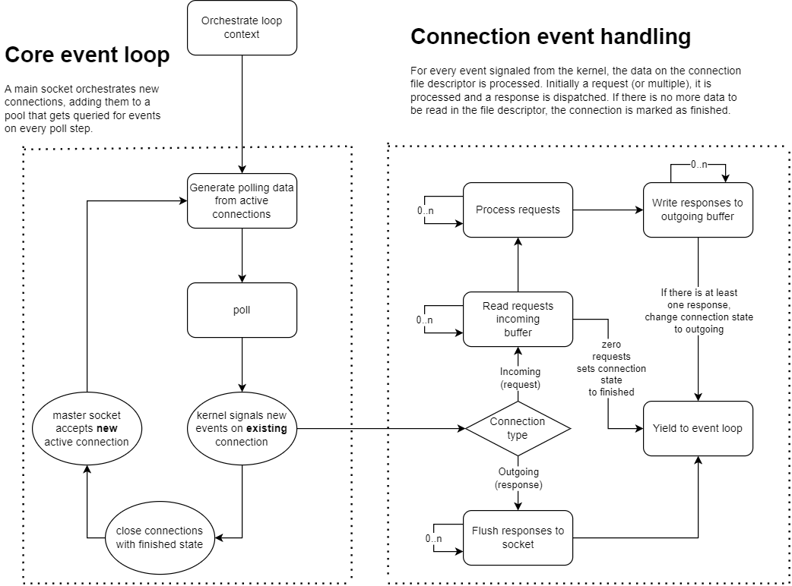

# Goris

Redis implementation in golang for educational purposes, using the book [Build your own Redis](https://build-your-own.org/#section-redis) as reference.

# Running

There are executables available under the `cmd` dir. One for a test client and another one for the server.
```sh
# On the root dir.

go run ./cmd/client

go run ./cmd/server
```

# Development

To execute the tests run `go test -v ./...` to recursively expand on subdirs. Verbosity flag provides information about the tests that have been run.


# General overview

This repo contains both a server and a client to test the server with. The communication is done thanks to a tiny protocol.

The server is structured around an event loop that [poll](https://man7.org/linux/man-pages/man2/poll.2.html)s for events in a main file descriptor. This main file descriptor is the one taking care of new connections.

## Available actions

For now the server simply echoes back the message.

## Building blocks

These are the basic conceptual components that are in place here.

### Protocol spec

The communication protocol is a very simple one. Reserve 4 bytes to set an unsigned integer that defines the total length of the message, and concat that to the actual payload.


### Event loop

The event loop is implemented synchronously, although the following diagram denotes our possible point of delegation that will articulate the work done by background threads.



